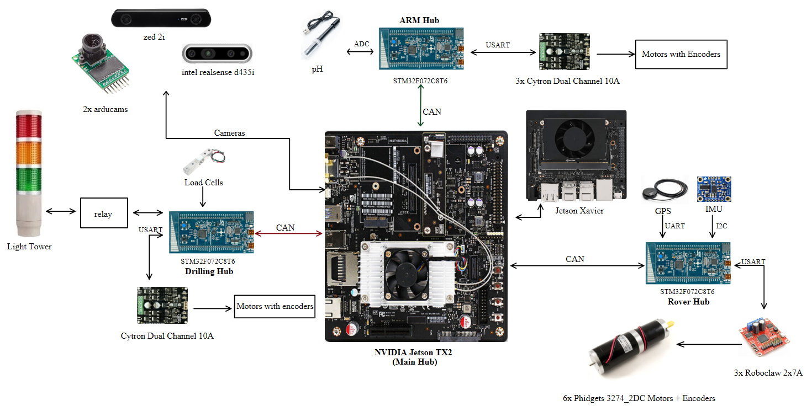

# ROAR_SENSOR_TESTING

ROAR_SENSOR_TESTING/
│
├── sensors/                    # Contains test code for various sensors
│   ├── arm/                    # Sensors used in the robotic arm
│   │   └── pH/                 # pH sensor testing
│   │
│   ├── drilling/              # Sensors used in the drilling system
│   │   ├── GPS/               # GPS sensor testing
│   │   └── IMU/               # IMU sensor testing
│   │
│   ├── rover/                 # Sensors mounted on the rover
│   │   └── Load_Cell/         # Load cell testing
│   │
│   └── README.md              # Overview of the sensor modules
│
├── CAN-Communication/              # Contains code and utilities to test CAN communication
│   ├── CAN_Testing_bluePill/      # Basic CAN send/receive test
│   ├── CAN_Testing_Roboclaw/       # Diagnostic messages over CAN
│   ├── CAN_Testing_F072/       #
│   ├── CAN_Final/       #
│   └── README.md
│
├── Motor-Drivers/             # Includes test cases for different motor drivers
│   ├── Cytron/             #
│   ├── Roboclaw/         #
│   ├── Encoder/         #
│   └── README.md
│
│
│
├── docs/                      # Documentation files and hardware test logs
│   └──
│
└── README.md                  # You are here!

## System integration

